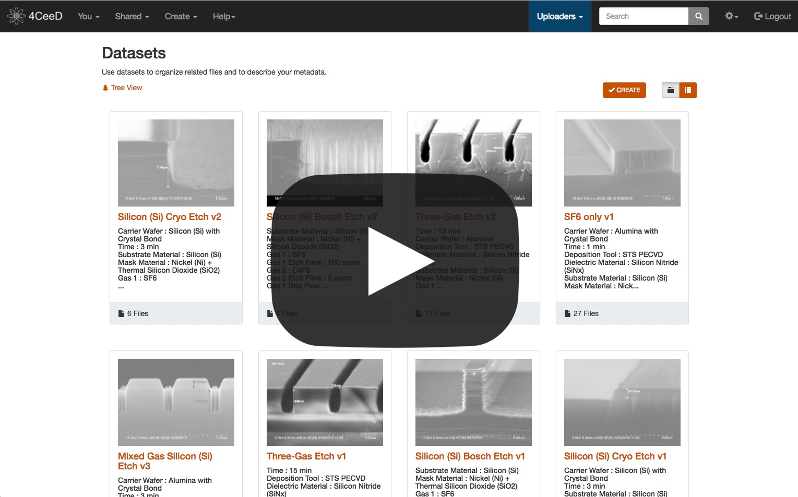

4CeeD Framework
====

4CeeD is a framework that supports **C**apture, **C**urate, **C**oordinate, **C**orrelate, and **D**istribute scientific data. For more information, visit 4CeeD's website at https://4ceed.github.io 

This repository consists of a collections of deployment scripts for various tools and components that make up the 4CeeD framework.

## 4CeeD In Action

Take a look at the following Youtube video to see how our scientific users use 4CeeD in real environment.

## Setup
- [docker-compose](docs/docker_setup.md): Setup 4CeeD as a group of Docker containers running on a single machine. The most simple way to setup 4CeeD. Recommended for a quick test of 4CeeD functionalities.
- [minikube](docs/minikube_setup.md): Recommended for a quick setup of 4CeeD running on Kubernetes environment.
- [Kubernetes](docs/kubernetes_setup.md): Setup 4CeeD on a Kubernetes cluster. Our recommended way to setup 4CeeD in production.
- [Google Cloud Platform](docs/gcp_setup.md): Setup 4CeeD on using Google Cloud Platform's Container Engine. 

## Other Resources
- [Register extractors](docs/register_extractors.md) 
- [Run 4CeeD in persistent mode](docs/persistent_mode.md) 
- [Access 4CeeD using domain name](docs/domain_name.md) 
- [Upgrade 4CeeD components](docs/upgrade.md) 
- [Setup Kubernetes v1.6.6 on Ubuntu 16.04 LTS cluster](docs/k8s_setup_ubuntu.md)

## Contact

Feel free to create an issue or pull request. Please contact Phuong Nguyen (pvnguye2 at illinois dot edu) if you have any question.
